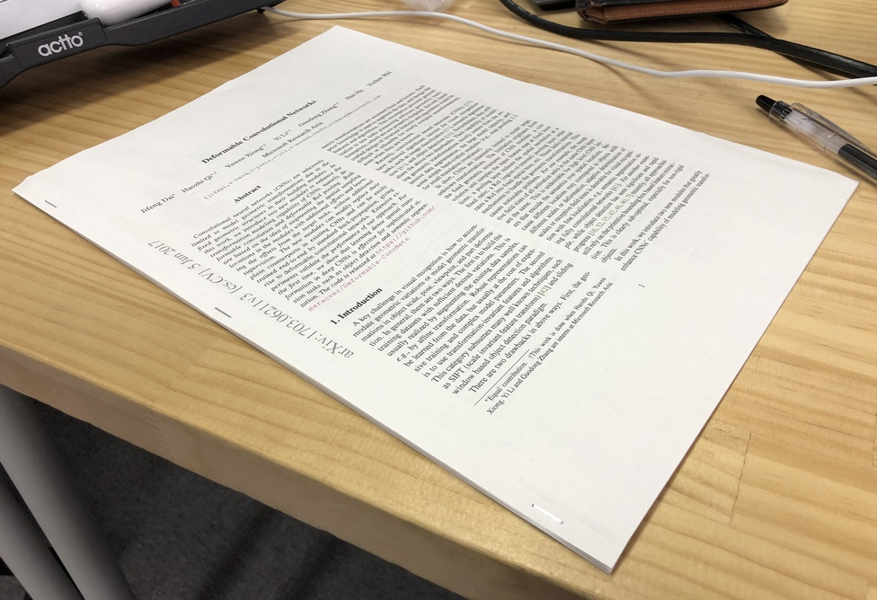
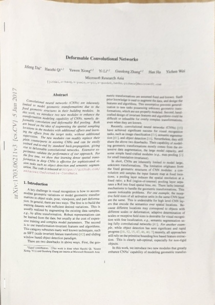

# image process

Transform image using homography matrix.

## Example

Before

After


## Installation

- Python: 3.7.5

```
$ git clone https://github.com/fltwtn/image_process.git
$ cd image_process

$ pip install -r requirements.txt
```

## Directory tree


## Configuration

Configurations are defined by `yacs`.  
https://github.com/rbgirshick/yacs

All you should prepare is `.yml` file defining data in `config/`.

### Example

```yml
io:
  input_dir: "data/"
  output_dir: "output/"

domain:
  image_list: ["example01.jpg", "example02.jpg"]
  # vertices of target rectangle in source images
  # order is top-left, top-right, bottom-right, bottom-left
  vertices_list:
    [
      [[12, 210], [373, 27], [955, 202], [678, 635]],
      [[12, 210], [373, 27], [955, 202], [678, 635]],
    ]

codomain:
  # image size after transformation
  # default is A4 size [width, height]
  image_size: [420, 594]
```

## Execution

Give your config file on the command line.

```
$ python main.py --config_file config/<your_config>.yml
```
